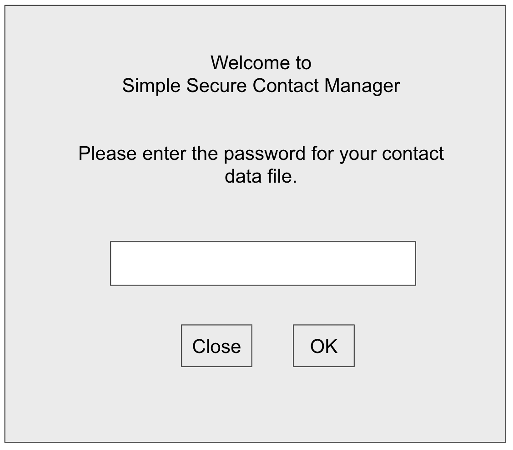
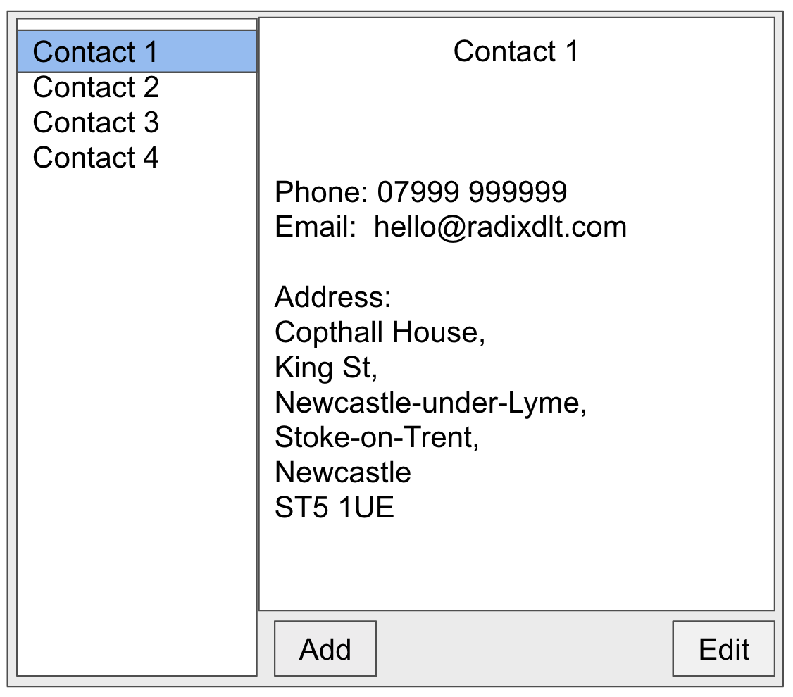

# The Radix Coding Challenge

This programming challenge is meant to assess your ability to translate ideas and incomplete specifications into working code, while dealing with problems that may be unfamiliar.

We will be assess your submission based on the implementation choices you have made, including design, frameworks used, code structure and other software engineering principles you have applied to your submission.

The expected time to finish this task is less than 8 hours.  There is no hard limit on the time allowed, although we would expect you to be able to complete it over a weekend.  Like any problem, it is worth spending some time to fully understand the requirements before starting coding.

We appreciate your confidentiality in regards to the instructions of this challenge.

# Secure Contact Manager

*Please note: your solution must be written in TypeScript*.

In this challenge you will be implementing a Simple Secure Contact Manager, a basic, but secure, version of contact managers found in many smart phones and operating systems.  You will need to store the contact data on-disk in an encrypted format, and a password will be required to open and use the contacts stored in the file.

You may use any file format you think is appropriate for the test, and any encryption mechanism you believe will prevent access to information in the data file by conventional computing techniques for the foreseeable future.

The application should be implemented ideally as an [Electron](https://www.electronjs.org/) application, but if you believe this will make the task exceed the time limits defined above, you may opt to implement as a web application that can be accessed through a browser.

You may use whatever frameworks and tools you believe are necessary to implement the application, and note in particular we are not expecting you to write low-level encryption code as part of this exercise.

## Application Overview

Write an application which presents a Simple Secure Contact Manager.
This application should have the following facilities:

- access to application data controlled by password
- decrypt and load contact file from disk, or create new file if none existing
- be able to detect if the correct password was used without displaying corrupted or garbage data
- add new contacts
- edit existing contacts
- search contacts by any field
- write encrypted modified contacts datafile to disk

You are free to choose any file format for saved data, however this data will need to be encrypted.  Please choose an encryption approach that you are confident will not leak information for the foreseeable future should someone have data the contents of the data file.

Please note that all of the wireframe diagrams in the specification below are intended as a guide to functionality.  Please use your creativity when selecting fonts, colours, sizing and exact layout.

You are not required to package the application for us, just the source code will be sufficient, but please make sure you include instructions on how to build and execute your application, as well as information on which operating system you used for development and testing.

### Initial application startup

On first startup, the application should show a window similar to the wireframe shown below.

### Subsequent application startup

On subsequent startup, where a data file is present, the application should show a startup window similar to the wireframe shown below.

When an incorrect password is specified, the application should display an error message indicating the password is incorrect, and once this message is  acknowledged, the application should allow the operator to retry entering the correct password.

### Display current contacts

On successful decryption of the data file, a contacts screen similar to the below should be displayed.  Note that as with all wireframes in this specification, exactly matching the layout is not required, but the layout should included a scrollable contact list and a details pane that shows the details of the selected contact.  There should also be provision to edit the selected contact and add a new contact.

### Adding a contact

Please provide a method for adding new contacts.  Required fields are:

- Name, single line
- Phone number, single line
- Email address, single line
- Address, multi-line

Please feel free to include any field validation you think is sensible, although none is required.

### Editing a contact

Please provide a method for editing existing contacts.  All fields should be editable.

### Saving the data file

You should take steps to ensure that the data file is written to disk frequently enough that operators do not lose a large amount of data.

## Important Notes

* Email <alexander@radixdlt.com> for any questions/problems.
* Please email your solution to <alexander@radixdlt.com> with instructions on how to build and run your solution.

